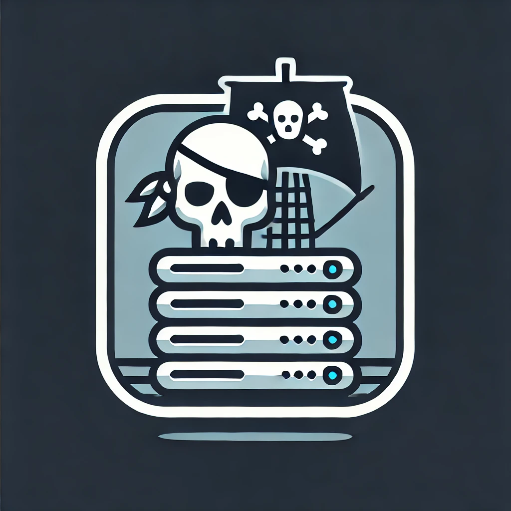

<!-- PROJECT LOGO -->
 

  

<h3 align="center">Archivum</h3>

  

    Archivum - Pirate Media Center
     
    <a href="https://github.com/ishotft/archivum"><strong>Explore the docs »</strong></a>
     
  

<!-- TABLE OF CONTENTS -->

  
Table of Contents

  <ol>
    <li><a href="#about-the-project">About The Project</a>
      <ul>
        <li><a href="#built-with">Built With</a></li>
        <li><a href="#yearly-cost">Yearly Cost</a></li>
      </ul>
    </li>
    <li><a href="#getting-started">Getting Started</a>
      <ul>
        <li><a href="#prerequisites">Prerequisites</a></li>
        <li><a href="#installation">Installation</a></li>
      </ul>
    </li>
    <li><a href="#configuration">Configuration</a>
      <ul>
        <li></li>
      </ul>
    </li>
    <li><a href="#storage">Storage</a>
      <ul>
        <li><a href="#using-external-or-mounted-drives">Using external or mounted drives</a>
          <ul>
            <li><a href="#mounted-drives">Mounted drives</a></li>
            <li><a href="#network-drives-cifs">Network drives (CIFS)</a></li>
          </ul>
        </li>
      </ul>
    </li>
    <li><a href="#customizations">Customizations</a>
      <ul>
        <li><a href="#ports">Ports</a>
          <ul>
            <li><a href="#port-forwarding">Port forwarding</a></li>
          </ul>
        </li>
      </ul>
    </li>
    <li><a href="#commands-cheatsheet">Commands Cheatsheet</a>
      <ul>
        <li><a href="#make-commands">Make Commands</a></li>
      </ul>
    </li>
  </ol>

<!-- ABOUT THE PROJECT -->
# Disclaimer

**This project is not yet finished, it is missing scripts to automatically configure all services based on your .env file.**

## About The Project

Pronunciation: `/ɑːrˈkɪvʊm/`

Archivum serves as a fully featured pirating media server, providing users with access to a vast collection of pirated media content. The primary aim is to offer an all-in-one solution for downloading, organizing, and streaming media such as movies, TV shows, and more.

(<a href="#readme-top">back to top</a>)

### Built With

- [![Sonarr][Sonarr]][Sonarr-url]
  - Sonarr is a PVR for Usenet and BitTorrent users. It can monitor multiple RSS feeds for new episodes of your favorite shows and will grab, sort, and rename them.
- [![Radarr][Radarr]][Radarr-url]
  - Radarr is a movie collection manager for Usenet and BitTorrent users. It can monitor multiple RSS feeds for new releases of your favorite movies and will grab, sort, and rename them.
- [![Deluge][Deluge]][Deluge-url]
  - Deluge is a lightweight, Free Software, cross-platform BitTorrent client. It is designed to run as both a normal standalone desktop application and as a client-server.
- [![Nginx][Nginx]][Nginx-url]
  - Nginx Proxy Manager is a tool for managing proxy hosts, redirections, and access lists. It simplifies the management of reverse proxy settings for your services.
- [![Organizr][Organizr]][Organizr-url]
  - Organizr is a tool that allows you to organize your services. It serves as a single access point to all your web services and applications.
- [![Duckdns][Duckdns]][Duckdns-url]
  - DuckDNS is a free dynamic DNS service that allows you to update your IP address and create subdomains for your home or office network.
- [![Plex][Plex]][Plex-url]
  - Plex is a media server that organizes your media library and streams it to any device. It provides a comprehensive solution for managing and accessing your media collection.
- [![Ombi][Ombi]][Ombi-url]
  - Ombi is a self-hosted web application that automatically gives your shared Plex or Emby users the ability to request content by themselves.
- [![Prowlarr][Prowlarr]][Prowlarr-url]
  - Prowlarr is an indexer manager/proxy built on the popular Sonarr/Radarr applications. It integrates seamlessly with your existing media management software.
- [![Sabnzbd][Sabnzbd]][Sabnzbd-url]
  - Sabnzbd is an Open Source Binary Newsreader written in Python. It simplifies the process of downloading from Usenet by automating the process of downloading, verifying, and extracting files.

Most images are from `lscr.io/linuxserver` and locked to the latest version, which means this stack will automatically stay up-to-date with the latest versions of the images.

### Yearly Cost

The following software is required, some of the services cost money (the usenet related services), the total yearly cost if you go for the full configuration (two usenet indexers and two usenet downloaders for optimal speed) is 177 USD / year (27 USD for indexers, 90 USD for downloaders). The minimal recommended configuration would cost 72 USD / year (1 indexer, 1 downloader), alternatively you can ignore all the usenet stuff and run completely for free by only using deluge / torrents, although this will diminish the ease of access to content.

| **Landlubber** (*aka non-pirate way*)               | **Archivum (Full)**     | **Archivum (Frugal)**  | **Archivum (Free)**             |
|------------------------------|-------------------------|------------------------|----------------------------------|
| Netflix (Standard): €161.88/year  | Indexers (2): $27/year     | Indexer (1): $12/year    | Deluge/Torrents: Free            |
| Amazon Prime: €49/year       | Downloaders (2): $90/year | Downloader (1): $60/year | Deluge/Torrents: Free            |
| Disney+: €89.90/year         |                         |                        |                                  |
| Apple TV+: €83.88/year       |                         |                        |                                  |
| HBO Max: €120/year           |                         |                        |                                  |
| Streamz: €143.40/year        |                         |                        |                                  |
| **TOTAL: €648.06/year**      | **TOTAL: $177/year**    | **TOTAL: $72/year**    | **TOTAL: Free**                  |

**We recommend "Archivum (Frugal)" method as the minimum to enjoy all usenet benefits while keeping costs low.**
*The prices for Archivum are based on my personal selected indexers and downloaders, you can find cheaper alternatives although always keep in mind that they might provide less content coverage or slower speeds.*

(<a href="#readme-top">back to top</a>)

<!-- GETTING STARTED -->

## Getting Started

This guide is writen with a Debian (eg. WSL2) or MacOS environment in mind, we do **NOT** recommend doing dev work on a plain old Windows OS.

### Prerequisites

- (If windows) WSL2 ([instructions][WSL2-url])
  - **HIGHLY RECOMMENDED** if using Windows as a host
- Docker Engine ([instructions][Docker-Install-Ubuntu-url])
  - If using a Windows host, running Docker Desktop on the host is sufficient (it will hook automatically into your WSL2 instance if configured as such in Docker Desktop (which is default config))
- Direnv ([instructions][Direnv-url])
  - Once installed, run `direnv allow` in root folder
- Make ([website][Make-Ubuntu])
- Accounts / Credentials:
  - [Duckdns][Duckdns-url] (free)
  - Usenet indexers:
    - NZBFinder ([site][NZBFinder-url]) (15 USD / year)
    - NZBGeek ([site][NZBGeek-url]) (12 USD / year)
  - Usenet downloaders: (you don't need two of these tbf)
    - FrugalUsenet ([site][frugelusenet-url]) (60 USD / year)
    - Newshosting ([site][newshosting-url]) (90 USD / year)

(<a href="#readme-top">back to top</a>)

### Installation

1. `cp .env.example .env`
2. Edit the `.env` file in the root folder
3. (WIP INSTRUCTIONS)

(<a href="#readme-top">back to top</a>)

## Configuration

### 

## Storage

### Using external or mounted drives

With the current configuration, Archivum will write the completed content to a local volume in this repository folder, however, ideally you want to write your completed content to a local NAS or a mounted external drive for increased storage capacity and ease of access. You can do this without much hassle by doing the following, you can use either one of the following options to achieve the same result:

#### Mounted drives

- Make sure you have the path to the mounted volume (eg. `/mnt/c`)
- Make a symbolic link to your mounted volume (and/or subfolder(s))
  - (root folder) `ln -s <TARGET> storage/downloads/complete`
- Make sure you have two folders in that location - `movies` and `series`

#### Network drives (CIFS)

- Look at the example in [docker-compose.yaml](docker-compose.yaml#290) file, at the bottom, "hetzner_storage_share", this is a mounted network drive from [Hetzner Robot][Hetzner-Robot-Storage]

## Customizations

### Ports

To obfuscate the purpose of this media server a little bit, we've chosen to deviate from the default ports used by these services. Here are the port mappings being used:

- sabnzbd
  - Configured port: 38080 (default is 8080)
- deluge
  - Configured port: 38081 (default is 8112)
  - Configured port: 6881:6881/udp (default is 58846)
- sonarr
  - Configured port: 38082 (default is 8989)
- radarr
  - Configured port: 38083 (default is 7878)
- prowlarr
  - Configured port: 38084 (default is 9696)
- ombi
  - Configured port: 38085 (default is 3579)
- plex
  - Configured port: *unchanged* (default is 32400)
- organizr
  - Configured port: 38086 (default is 80)
  
#### Port forwarding

Without changing any configuration files, you only need to expose port 80 and 443 on your router to access services over the internet. If you don't plan to ever access the media server remotely, we recommend keeping these ports closed.
We are forcing HTTPS connections so the 80 port is purely to catch unprotected requests and forward them to 443.

## Commands Cheatsheet

### Make Commands

- Start the composed containers (without VPN layer):
  - `make up`

- Stop the composed containers (without VPN layer):
  - `make down`
  
- Start the composed containers (**with** VPN layer):
  - `make up.vpn`
  
- Stop the composed containers (**with** VPN layer):
  - `make down.vpn`

- Enforce correct file system permissions:
  - `make perm`

- Mount the 'D'-drive from Windows host to your WSL2 instance: (change the drive letter as needed [here](Makefile#16))
  - `make mount`
  
- Generate a strong hashing password and print into console:
  - `make hash.strong`
  
- Generate a random, human readable password:
  - `make hash.human`

[newshosting-url]: https://www.newshosting.com/
[frugelusenet-url]: https://frugalusenet.com/
[NZBGeek-url]: https://nzbgeek.info/
[WSL2-url]: https://learn.microsoft.com/en-us/windows/wsl/install
[Direnv-url]: https://direnv.net/
[Docker-Install-Ubuntu-url]: https://docs.docker.com/engine/install/ubuntu/#installation-methods
[Make-Ubuntu]: https://wiki.ubuntu.com/ubuntu-make
[Hetzner-Robot-Storage]: https://robot.hetzner.com/storage
[NZBFinder-url]: https://nzbfinder.ws/
[Sonarr]: https://img.shields.io/badge/Sonarr-2D81FF?style=for-the-badge&logo=sonarr&logoColor=white
[Sonarr-url]: https://sonarr.tv/
[Radarr]: https://img.shields.io/badge/Radarr-2D81FF?style=for-the-badge&logo=radarr&logoColor=white
[Radarr-url]: https://radarr.video/
[Deluge]: https://img.shields.io/badge/Deluge-2D81FF?style=for-the-badge&logo=deluge&logoColor=white
[Deluge-url]: https://deluge-torrent.org/
[Nginx]: https://img.shields.io/badge/Nginx-269539?style=for-the-badge&logo=nginx&logoColor=white
[Nginx-url]: https://nginx.org/
[Organizr]: https://img.shields.io/badge/Organizr-3D3D3D?style=for-the-badge&logo=organizr&logoColor=white
[Organizr-url]: https://organizr.app/
[Duckdns]: https://img.shields.io/badge/Duckdns-9FE9C8?style=for-the-badge&logo=duckdns&logoColor=black
[Duckdns-url]: https://www.duckdns.org/
[Plex]: https://img.shields.io/badge/Plex-E5A00D?style=for-the-badge&logo=plex&logoColor=white
[Plex-url]: https://www.plex.tv/
[Ombi]: https://img.shields.io/badge/Ombi-000000?style=for-the-badge&logo=ombi&logoColor=white
[Ombi-url]: https://ombi.io/
[Prowlarr]: https://img.shields.io/badge/Prowlarr-FF5E5B?style=for-the-badge&logo=prowlarr&logoColor=white
[Prowlarr-url]: https://prowlarr.com/
[Sabnzbd]: https://img.shields.io/badge/Sabnzbd-F29111?style=for-the-badge&logo=sabnzbd&logoColor=white
[Sabnzbd-url]: https://sabnzbd.org/